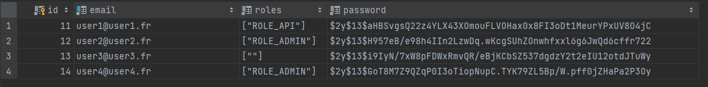

SchtroupfVisor permet de schtroumpfer les avis clients et de pouvoir schtroupfer la base de schtroumpf client pour plusieurs schtroumpf

( PHP 8.03 symfony cli v4.23.5 et windows 11 (tout disfonctionnement du à Linux ou Macosne sera pas pris en charge, merci d'installer windows 11 pour lance ce programme dans les meilleures conditions ))

Voici les étapes à réaliser pour l'install

1-composer install

2-php bin/console d:s:u --force

3-php bin/console d:f:l

les données : 

TODO: 

les routes
Pour générer un token 
une fois le token récupéré, il est à mettre dans le header des requeêtes:

get
     -toutes les reviews d'un site ( en fournissant l'id ) public token Done
   
    -la liste des schtroumpf token Done

post

    -post une review ( id + contenu ) token Done

ici on n'as accès à cette route que si on est enregistré dans la base comme ADMIN ou CREATOR ( a voir dans le voter )
	
    -modérer ( donc modifier une review ) token  + role
    -supprimer une review ( donc modifier une review ) token  + role 
	dans cette api , les différents états des commentaires seront traités de la façon suivante 
        status = 1 pas encore accepté
        status = 2 accepté 
        status = 3 supprimé 
    Ces états seront gérés par le client qui consommera les données 

    -register un site token + role ( il faut être ADMIN pour le faire ) Done

Le service de schtroumpfage des textes Done les textes des reviews sont modifiés pour être schtroumfés

Les Données sont générées grace aux fixtures 
voici les users générés pa les fixtures

il faut utiliser les emails dans le champ username de la route login , et le mot de passe est password